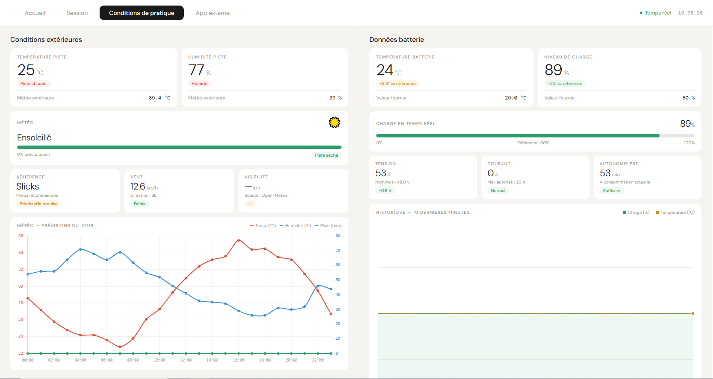
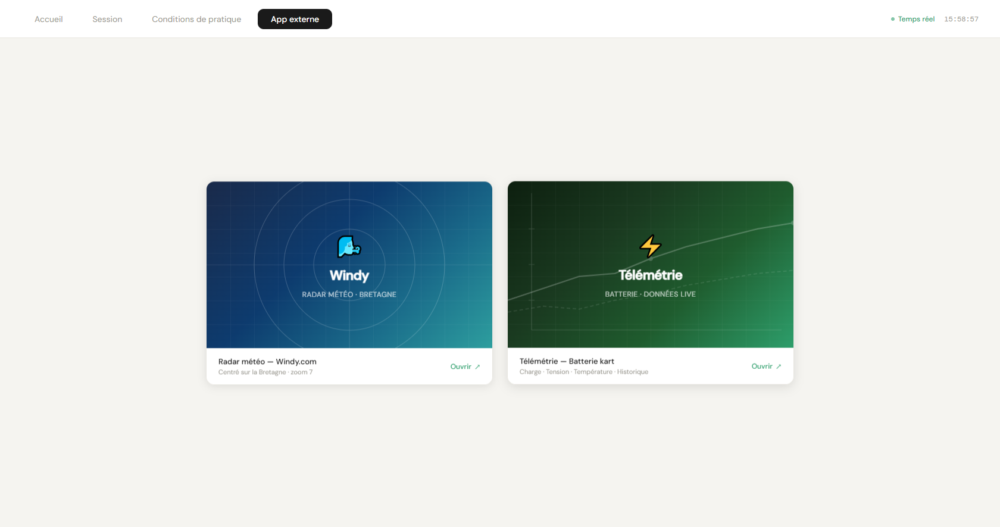

# Projet-kart

 
Système de télémétrie et d'instrumentation pour kart de compétition.

Un projet complet de collecte et visualisation de données en temps réel pour un kart équipé de capteurs. Les mesures (température, humidité, batterie) sont transmises via un Raspberry Pi et exploitées par une interface web.

Stack : Raspberry Pi + MySQL + PHP + Html + CSS + Javascript  
Statut : En développement (site web | capteurs | montage électrique)  
Équipe : 4 étudiants de Terminal STI2D

• 📁 Public

## Arborescence détaillée du projet

| Niveau 1       | Niveau 2      | Niveau 3                        | Description                                                                                     |
|----------------|---------------|----------------------------------|-------------------------------------------------------------------------------------------------|
| 📁 Projet-kart/   |               |                                  | Racine du projet, point d'entrée du dépôt.                                                      |
|                | 📁 Louan/     | README.md, fichiers divers       | Espace personnel de Louan : docs ou éléments propres à Louan.                                   |
|                | 📁 Loevan/    | README.md, fichiers divers       | Espace personnel de Loevan : docs ou éléments propres à Loevan.                                 |
|                | 📁 Mathys/    | README.md, fichiers divers       | Espace personnel de Mathys : docs ou éléments propres à Mathys.                                 |
|                | 📁 Noah/      | README.md, fichiers divers       | Espace personnel de Noah : docs ou éléments propres à Noah.                                     |
|                | 📁 Documents/ | README.md, docs projets         | Documentation centrale : description outils, comptes-rendus, notes, docs communs, liens utiles. |
|                | 📁 Illustrations/ | images, captures d’écran        | Illustrations du projet : schémas, screenshots, visuels sur le projet ou son site.              |
|                | 📁 Projet-Kart/ | fichiers du projet concret      | Code source (PHP, JS, HTML, CSS) servi par le Raspberry Pi, scripts métier, etc.                |
|                | 📁 diagrammes/ | fichiers diagrammes              | Diagrammes : architecture, séquences, schémas techniques.                                      |
|                | README.md      |                                  | Page d’accueil et de présentation générale du dépôt.                                            |

---

### Liens utiles
- [Site principal](https://jaguarfbl.github.io/Projet-kart/) ( hebergé sur GitHub, pas de php ou de données )
- [Site Raspberry Pi](http://10.6.10.65/) ( site officiel )
- [Site Télémétrie](http://10.6.10.65/telemetrie.php)
- [Accès MySQL](http://10.6.10.65/phpmyadmin) --> identifiant: root et code: poteau 
- [API Météo](https://open-meteo.com/en/docs/meteofrance-api?location_mode=csv_coordinates&bounding_box=-90,-180,90,180&forecast_days=1&hourly=temperature_2m,relative_humidity_2m,rain)
- Les codes raspberry sont "poteau" tout le temps

---

### Illustrations / Screens

#### Accueil :

 
Résumé bref de l'ensemble du site comme l'heure, la tempérture ambiante, les prochains Grand prix, un tableau des meilleurs temps et le podium.
 
 
#### Sessions :

 
Page permettant de démarrer l'enregistrement du tour, pour cela appuyer sur "Démarrer" et mettre le nom du pilote.
Il y a aussi le détaille de tour de la session et le profil du pilote ( en bas à gauche ).
 
 
#### Conditions de pratique :

 
Affichage des conditions extérieur et de la batterie grace au différent capteurs.
 
Le tableau en bas est a gauche est les prévisons météo de la journée récupérée via API ( regarder les liens utiles ).
 
 

#### App Externe :

 
Liens de deux pages suplémentaires du projet
 
 

#### Télémétrie :

 
Affichage en temps réel des données du Kart notamment la batterie, le courant et la température de la batterie du kart élétrique.
 
 
#### Windy :

 
Application web gratuite pour avoir une carte intéractive avec carte satellite et bien plus.
 
 

---

## Utilisation

---

### Auteurs
- [@JaguarFBL](https://github.com/JaguarFBL) → test
- [@Linklink33](https://github.com/linklink33) → Branchement
- [@Loevan1](https://github.com/Loevan1) → Radio
- [@dragonwhite11](https://github.com/dragonwhite11) → Modélisation

