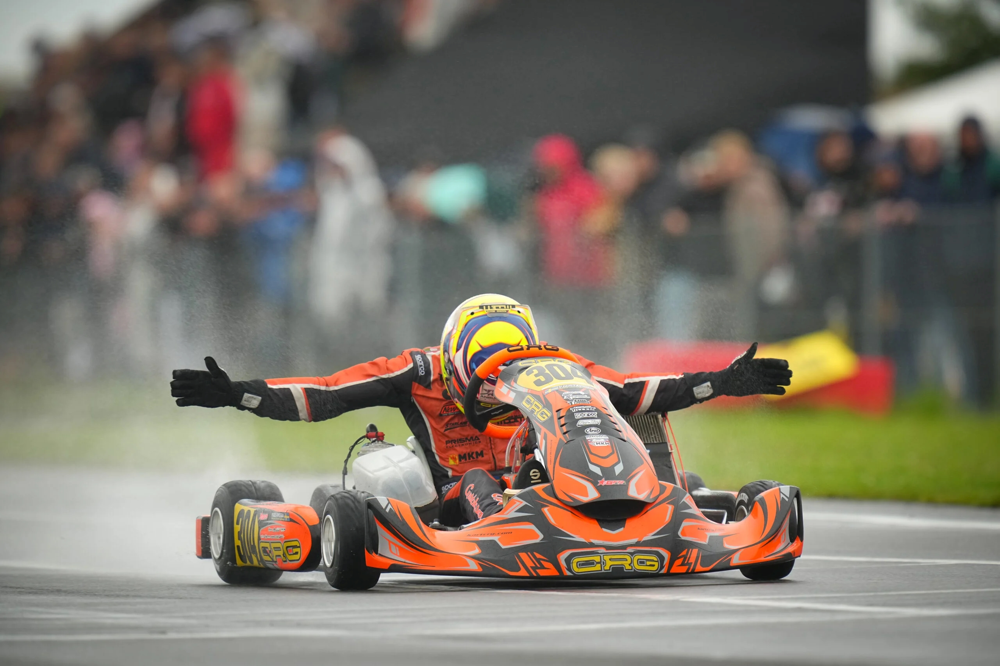

# Projet-kart

 

C'est un projet d'instrumentation d'un kart afin de récolter des données et de les afficher sur un site web

Explication
-----------
| Niveau 1 | Niveau 2 | Niveau 3 |
| --- | --- | --- |
| 📁 Projet-kart/ |  |  |
|  | 📁 Louan/ | 📄 explication espace perso.md |
|  | 📁 Loevan/ | 📄 explication espace perso.md |
|  | 📁 Mathys/ | 📄 explication espace perso.md |
|  | 📁 Noah/ | 📄 explication espace perso.md |
|  | 📁 Documents/ | 📄 Doc des outils utilisé et du projet |
|  | 📁 projet-kart/ | 📄 Fichiers du projet concret |
|  | 📄 explication du concept.md |  |

 

Liens utiles :
------------

lien du site : https://jaguarfbl.github.io/Projet-kart/ 
site raspberry : http://10.6.10.65/  
lien MySQL : http://10.6.10.65/phpmyadmin  
API Météo : https://open-meteo.com/en/docs/meteofrance-api?location_mode=csv_coordinates&bounding_box=-90,-180,90,180&forecast_days=1&hourly=temperature_2m,relative_humidity_2m,rain

 

Illustrations / screens :
------------

## Accuille :

## Sessions :

 

##  Auteurs  

- [@JaguarFBL](https://github.com/JaguarFBL) -> test
- [@Linklink33](https://github.com/linklink33) -> Branchement
- [@Loevan1](https://github.com/Loevan1) -> Radio
- [@dragonwhite11](https://github.com/dragonwhite11) -> Modélisation
